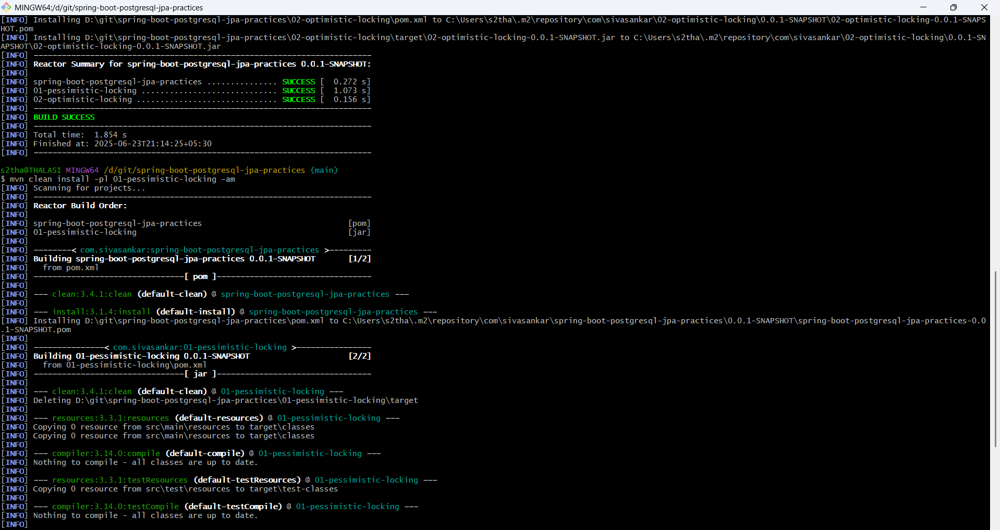
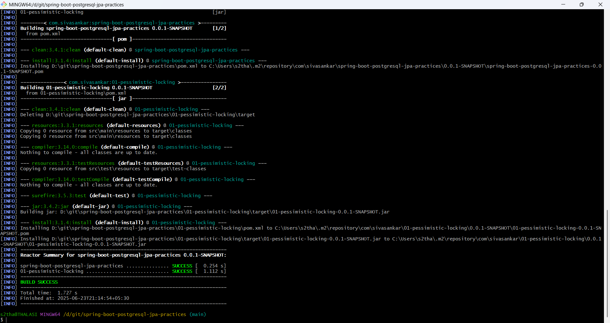

# spring-boot-postgresql-jpa-practices

Build the Whole Project:

    mvn clean install
	

	
Build a Specific Module:

	mvn clean install -pl module-name -am

	-pl: Build this module
	-am: Also build its dependencies

	Ex:

	  mvn clean install -pl 01-pessimistic-locking -am

